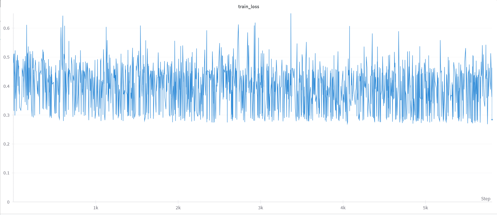

# Lora
According to https://huggingface.co/docs/diffusers/training/lora
## Installation
```dos
git clone https://github.com/huggingface/diffusers
cd diffusers
pip install .
pip install wandb
```
## Set a default Accelerate environment 
```dos
accelerate config default
```
## Launch
```dos
export MODEL_NAME="stabilityai/stable-diffusion-2"
export OUTPUT_DIR="output"
export HUB_MODEL_ID="pokemon-lora"
export DATASET_NAME="dataset"

accelerate launch --mixed_precision="bf16"  train_text_to_image_lora.py \
  --pretrained_model_name_or_path=$MODEL_NAME \
  --dataset_name=$DATASET_NAME \
  --dataloader_num_workers=8 \
  --resolution=512 \
  --center_crop \
  --random_flip \
  --train_batch_size=1 \
  --gradient_accumulation_steps=4 \
  --max_train_steps=15000 \
  --learning_rate=1e-04 \
  --max_grad_norm=1 \
  --lr_scheduler="cosine" \
  --lr_warmup_steps=0 \
  --output_dir=${OUTPUT_DIR} \
  --push_to_hub \
  --hub_model_id=${HUB_MODEL_ID} \
  --report_to=wandb \
  --checkpointing_steps=500 \
  --validation_prompt="abiuwdad" \
  --seed=1337
```
## Result
### Prompt: abiuwdad
如果train更久應該可以生得更好，但來不及

## Training loss

